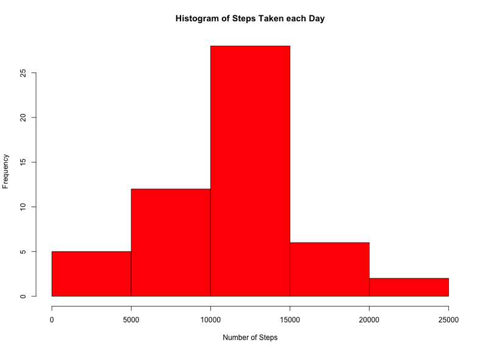
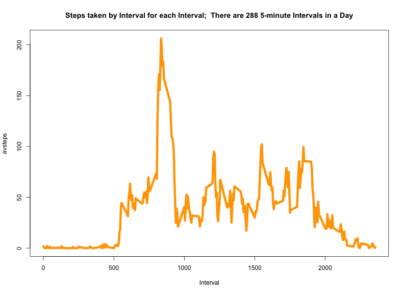
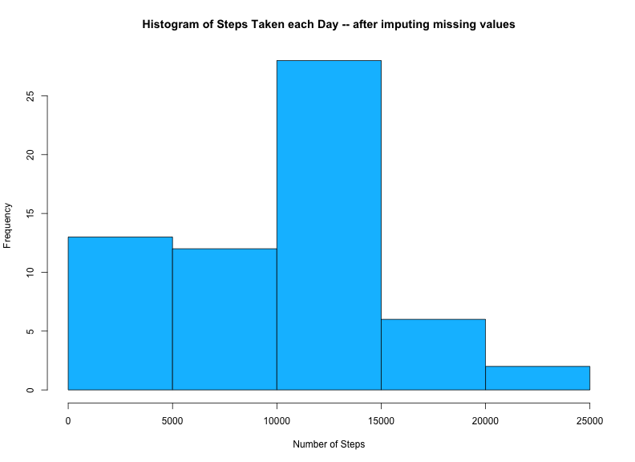
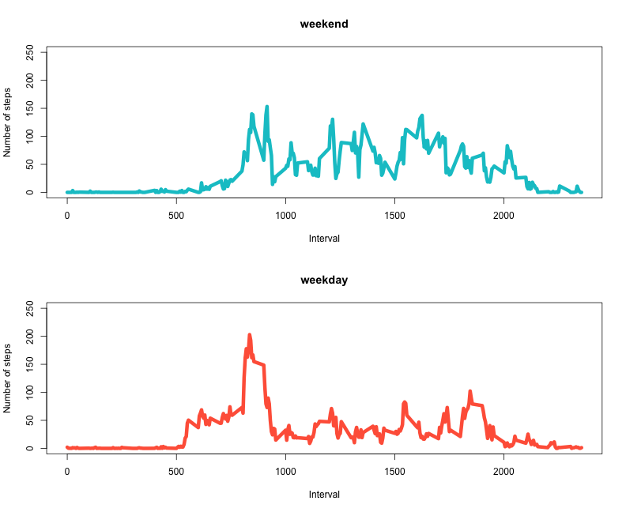

Reproducible Research:  Peer Assignment 1
========================================================

This fascinating new assignment looks at Activity Monitoring Data from the Activity Dataset.  The file is called activity.csv that was downloaded from the url provided.  The variables in the dataset are:
* "steps"
* "date" in YYYY-MM-DD format, and 
* "interval"

##  **Loading and pre-processing data**


```r
activity <- read.csv("activity.csv")
steps <- tapply(activity$steps, activity$date, sum)
steps <- as.data.frame(steps)
```


## What is mean total number of steps taken per day?

Now, we plot the Histogram of Number of Steps taken each Day.  We use the hist function for the Histogram as well as the barplot function to show the number of steps taken each day for the 61 days.  We also calculate the **Mean** and **Median** of total steps taken each day:


```r
hist(steps[, 1], col = "red", main = "Histogram of Steps Taken each Day", xlab = "Number of Steps")
```

 

```r
barplot(steps[, 1], names.arg = rownames(steps), col = "blue", main = "Steps taken by Day for each Day", 
    xlab = "Dates")
```

 

```r
meanSteps <- mean(steps[, 1], na.rm = TRUE)
print(paste0("Mean: ", as.character(round(meanSteps, digits = 2))))
```

```
## [1] "Mean: 10766.19"
```

```r
print(paste0("Median: ", as.character(median(steps[, 1], na.rm = TRUE))))
```

```
## [1] "Median: 10765"
```


## What is the average daily activity pattern?

This code plots the average number of steps taken in each 5-minute interval, for all the five minute intervals in a day.


```r
activity$intf <- factor(activity$interval)
avsteps <- tapply(activity$steps, activity$intf, mean, na.rm = TRUE)
avsteps <- as.data.frame(avsteps)
avsteps$int <- rownames(avsteps)
plot(avsteps ~ int, data = avsteps, col = "orange", main = "Steps taken by Interval for each Interval;  There are 288 5-minute Intervals in a Day", 
    xlab = "Interval", type = "n")
lines(avsteps$int, avsteps$av, type = "l", col = "orange", lwd = 6)
```

```
## Warning: Name partially matched in data frame
```

 

```r
print(paste0("5-Minute Interval with the Maximum Number of Steps: ", as.character(with(avsteps, 
    int[avsteps == max(avsteps)]))))
```

```
## [1] "5-Minute Interval with the Maximum Number of Steps: 835"
```


## Imputing missing values

We will first need to determine which columns of the activity data frame has NA values. The code below determines the columns for which we need to impute the missing values.  Of course, this is easily done by applying anyNA() successively to each column, and going with the columns for which the value is TRUE.  But I like to inflict pain upon myself and automate even the most obvious tasks via software.  so, here goes the first bit of code:


```r
cnum <- as.numeric()  #Initialze
activitynames <- names(activity)
for (i in 1:ncol(activity)) {
    if (anyNA(activity[, i])) {
        cnum[i] <- i
    }
}
print(paste0("The columns of activity data frame with missing values are: ", 
    activitynames[cnum]))
```

```
## [1] "The columns of activity data frame with missing values are: steps"
```


OK, so now we know which columns in activity have the dreaded **missing values**.  This information is captured in the cnum vector.  So, here is my filling strategy for missing values.  I basically take a 3-interval moving average, stored in a vector called temp, and replace the NA value with the current moving average.  Length of the temp vector is 3.  The code is provided below:


```r
temp <- as.numeric()  #Initialze
temp[1:3] <- 0
meantemp <- mean(temp)
missingvalues <- 0
k <- 1
for (j in 1:length(cnum)) {
    for (i in 1:nrow(activity)) {
        if (is.na(activity[i, j])) {
            activity[i, j] <- meantemp
            missingvalues <- missingvalues + 1
        } else if (k == 1) {
            temp[k] <- activity[i, j]
            k <- 2
        } else if (k == 2) {
            temp[k] <- activity[i, j]
            k <- 3
        } else if (k == 3) {
            temp[k] <- activity[i, j]
            k <- 1
        }
        meantemp <- mean(temp)
    }
}


print(paste0("Number of missing values: ", as.character(missingvalues)))
```

```
## [1] "Number of missing values: 2304"
```

```r
steps <- tapply(activity$steps, activity$date, sum)
steps <- as.data.frame(steps)
hist(steps[, 1], col = "deepskyblue", main = "Histogram of Steps Taken each Day -- after imputing missing values", 
    xlab = "Number of Steps")
```

 

```r
meanSteps <- mean(steps[, 1])
print(paste0("Mean: ", as.character(round(meanSteps, digits = 2))))
```

```
## [1] "Mean: 9354.23"
```

```r
print(paste0("Median: ", as.character(median(steps[, 1]))))
```

```
## [1] "Median: 10395"
```


## Are there differences in activity patterns between weekdays and weekends?

The code below creates a new factor variable called "dayf".  This factor variable has 2 levels:  weekday and weekend.  dayf is, of course, the fifth column in the activity data frame.  A new data frame is created called avgsteps, which has three columns:  Int (interval), weekday and weekend.  The data in the data frame is the average of the number of steps for each interval.  This was calculated using the tapply function.


```r
weekDay <- c("Monday", "Tuesday", "Wednesday", "Thursday", "Friday")
weekEnd <- c("Saturday", "Sunday")
activity$date <- as.character(activity$date)
activity$date <- as.POSIXct(activity$date)
j <- ncol(activity) + 1
for (i in 1:nrow(activity)) {
    if (weekdays(activity[i, "date"]) %in% weekDay) {
        activity[i, j] <- "weekday"
    } else {
        activity[i, j] <- "weekend"
    }
}
colnames(activity)[j] <- "dayf"
avgsteps <- with(activity, tapply(steps, list(interval, dayf), mean))
avgsteps <- as.data.frame(avgsteps)
avgsteps$int <- rownames(avsteps)
par(mfrow = c(2, 1))
with(avgsteps, {
    plot(int, weekend, main = "weekend", type = "l", col = "turquoise3", lwd = 6, 
        xlab = "Interval", ylab = "Number of steps", ylim = c(0, 250))
    plot(int, weekday, main = "weekday", type = "l", col = "tomato", lwd = 6, 
        xlab = "Interval", ylab = "Number of steps", ylim = c(0, 250))
})
```

 

